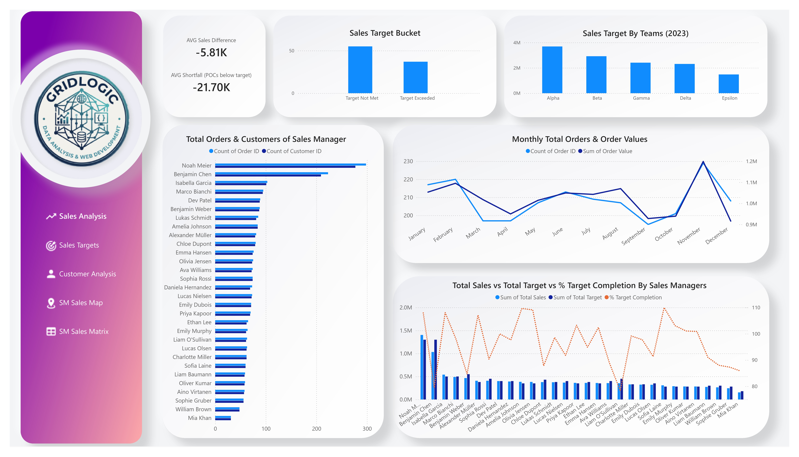

# E-Commerce Order Analysis – Power BI Dashboard

A 5-page Power BI dashboard on **2,500 orders (Jan–Dec 2023)** across 14 countries, 92 sales reps (POCs) and 30 sales managers.

> Project completed as part of my Data Analytics course (Coding Ninjas × IITM Pravartak).



## Problem
- Management could not see **who was missing their 2023 sales target**, by rep, manager or team.
- **42% of customers had never placed an order**, and there was no view of where they sit.
- Sales by country and by manager were scattered across reports.

## Solution
| Page | What it answers |
|------|-----------------|
| Sales Analysis | Orders and value by manager and month, target status by team |
| Sales Targets | Average sales vs target per manager, filterable by manager, POC, team and sales difference |
| Customer Analysis | Who orders and who doesn't (by category and gender), orders by country and source |
| SM Sales Map | Order value by manager and country, with drill-through |
| SM Sales Matrix | Drill-through page: manager × country sales |


## Key Findings
- **Targets missed:** 12.28M sales vs 12.81M target = **95.8% (−4.2%)**. 55 of 92 POCs missed target and 37 beat it.
- **Teams:** Alpha is the only team above target (104.7%); Delta is lowest (86.6%).
- **Managers:** 19 of 30 are below target. The lowest is Liam O'Sullivan (78.3%).
- **Customers:** 1,047 of 2,500 (41.9%) never ordered. All 500 customers in Category E are inactive; Categories A–D are 25–30% inactive.
- **Markets:** the USA is 35.5% of orders, and the top 5 countries hold 78.4%.
- **Channels:** Website, WhatsApp, App and Other are balanced (592–647 orders each).

## Recommendations
- Coach the lowest teams (Delta, Epsilon) and the POCs furthest below target.
- Re-engage Category E and the inactive customers in A–D.
- Reduce dependence on the USA by growing France, India and Spain.

## How It Was Built
- **Data model:** `Orders`, `Customers`, `Sales Targets` (2 many-to-one relationships).
- **DAX:** calculated columns (`Sales By Poc`, `Target Bucket`, `Sales Difference`), a calculated table for manager targets, and measures (`Total Sales`, `Total Target`, `% Target Completion`, `Avg Sales per Manager`, `Avg Target per Manager`, `% CustomersDidNotOrder`).
- **Interactivity:** slicers, page navigation and a drill-through from the map to the matrix.
- **Visuals:** cards, maps, matrix, column, bar, line and combo charts.

**Tools:** Power BI Desktop, DAX

## Notes
- No currency is stated in the source data, so values are shown without a symbol.
- Target figures are for the full year 2023. Sales By Poc and the manager charts on page 1 are static and don't respond to slicers; page 2 uses measures and does.
- Open the `.pbix` in Power BI Desktop to use the slicers and drill-through.

## Files
```
├── README.md
├── E_Commerce_Order_Project.pbix   # Full report (open in Power BI Desktop)
└── images/                         # Page screenshots
```

## Author
**Shayantan Mitra** – Data Reporting & Operations Analyst
[LinkedIn](https://www.linkedin.com/in/shayantanmitra96) · [GitHub](https://github.com/Dairanji)
